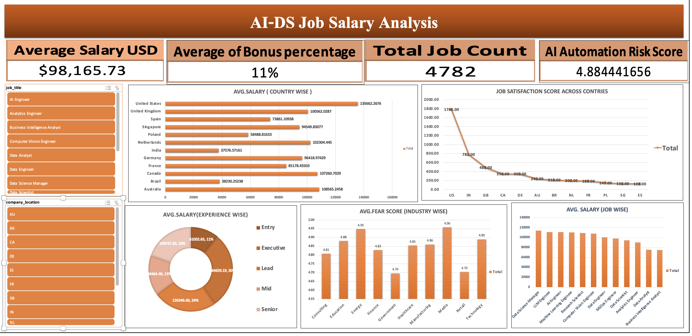

# AI & Data Science Job Salary Analysis 2026

An end-to-end analysis of AI and Data Science job salaries, built to understand which roles, experience levels and locations pay the most.

## Dashboard Preview

## Project Overview

- **Goal:** Analyze salary trends across AI and Data Science roles in 2026
- **Dataset:** `ai_ds_job_salaries_2026.csv`
- **Dashboard file:** `AI-DS Job Salary Analysis 2026.xlsx`

## Tools Used

- Microsoft Excel (Power Query for data cleaning, pivot tables, charts)

## Key Questions

- Which job roles have the highest average salary?
- How does experience level affect salary?
- How do salaries differ by country / company size / work type?

## Key Insights

1. **Role matters:** Data Science Managers earn the most (avg $132.6K), about 72% more than Data Analysts ($77.2K). Research Scientists ($128.2K) and LLM Engineers ($120.8K) follow, while BI Analysts ($74.5K) and Data Analysts earn the least.
2. **Experience and company size drive pay:** Executives earn about 2.6x more than entry-level roles ($176.2K vs $67.5K). Large companies pay roughly 31% more than small ones on average ($118.6K vs $90.4K).
3. **Industry and education both lift salary:** Finance pays the most ($124.7K) and Education the least ($82.4K). PhD holders average $115.0K, about 23% more than self-taught professionals ($93.6K), and bootcamp grads earn the least ($86.0K).

## Data Cleaning Steps

- Removed duplicates and null values
- Standardized column formats

## Files in this Repository

| File | Description |
|------|-------------|
| `AI-DS Job Salary Analysis 2026.xlsx` | Excel workbook with analysis and dashboard |
| `ai_ds_job_salaries_2026.csv` | Raw dataset |
| `ProjectSS..png` | Dashboard screenshot |

## Author

**Akash Nikam**
GitHub: [akashnikam5847](https://github.com/akashnikam5847)
